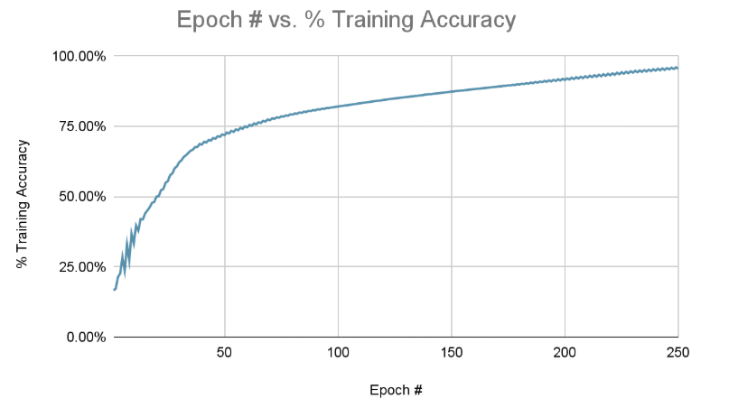

# Neural Network Case Study
Backpropagation neural network built from scratch in Python to classify binary digits. Case study covering architecture and design decisions.

> **Note:** This is a write-up of individual coursework completed at the University at Buffalo. Source code is kept private in accordance with UB's academic integrity guidelines. This document describes the problem, my architecture decisions, and the results.

---

## What is this

A backpropagation neural network built from scratch in Python to classify binary digits (0–7) from a dataset of 70,000 binary input vectors. The network was trained entirely without ML frameworks like PyTorch or TensorFlow — weights, forward pass, backprop, and gradient descent were all implemented manually using NumPy.

Final classification accuracy: **95.53%**

---

## The Problem

Given a flattened binary matrix as input (100 features per sample), classify which digit (0–7) it represents. Output is one of 8 classes encoded as one-hot vectors.

---

## Architecture

| Component | Choice |
|---|---|
| Language | Python (NumPy only) |
| Layers | 3 (input → hidden → output) |
| Input neurons | 100 |
| Hidden neurons | 50 |
| Output neurons | 8 (one per class) |
| Hidden activation | 1.7159 · tanh(2x) |
| Output activation | Softmax |
| Loss function | Cross-entropy |
| Weight initialization | Xavier initialization |
| Training method | Batch gradient descent + backpropagation |
| Learning rate | 0.17 |

---

## Design Decisions

**Xavier weight initialization**
Weights initialized too large cause unit saturation, weights too small flatten the error surface, and zero weights prevent learning entirely. Xavier initialization draws from a distribution with mean 0 scaled to the layer size, keeping gradients stable through early training.

**Hidden layer activation: 1.7159·tanh(2x)**
Standard tanh works but this scaled variant has its second derivative peak at 1, giving a better balance between linearity and non-linearity during training. It's a small change that measurably improves convergence behavior.

**Single hidden layer with 50 neurons**
Adding more hidden layers risks overfitting on a dataset this size. Half the input dimension (100 → 50) felt like a reasonable middle ground — enough capacity to learn meaningful features without memorizing the training set.

**Learning rate of 0.17**
Too high and the loss fails to converge, too low and training is unnecessarily slow. 0.17 was chosen empirically and produced stable convergence across 250 epochs.

**Serializing trained weights**
Rather than retraining on every run, the final weight matrices are saved to a `.npz` file and loaded for inference. This separates training from prediction — a cleaner architecture that mirrors how production ML systems actually work.

---

## Results

The model reached **95.53% classification accuracy** over 250 training epochs. The training curve below shows rapid early gains flattening into steady improvement — characteristic of a well-tuned learning rate without overshooting.

---

## A Note on Source Code

Source code is kept private in accordance with UB's academic integrity guidelines. This document describes the implementation and design decisions based on my own work and project report.
